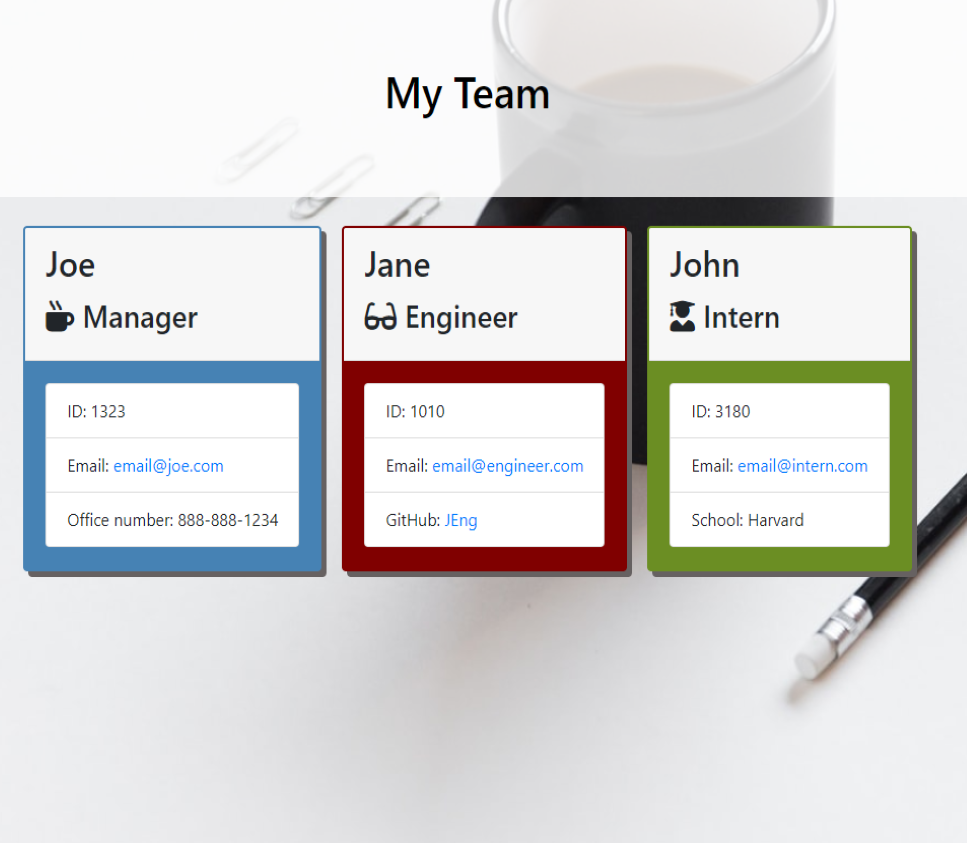

  

# Team Template Engine



## Version:
1.0.0


## Description of Team Template Engine:
A software engineering team generator command line application. This application prompts the user for information about the team members they would like to add, starting with a Manager, followed by either an Engineer or an Intern. The user can input any number of team members and allows a mix of managers, interns, and team members. When the team has been built, the application creates and HTML file that displays a formatted team roster based on the information provided by the user. The HTML file can then be opened in the browser to reveal the selected information.

* As a manager 
* I want to generate a webpage that displays my team's basic info 
* So that I have quick access to emails and GitHub profiles.


## Table of Contents:
* TITLE
* VERSION
* DESCRIPTION
* INSTALLATION
* USAGE
* LICENSE
* CONTRIBUTING
* TESTS
* CONTACT


## Installation: 
### Use the following instruction to install: 

Run from terminal using ```node app.js```

Note: The generated HTML file will need to be opened in your browser once you have input the team information into the CLI. 


## Usage: 
This application is intended to assist with organization of employee information to be easily accessed by management. 


## License: 


## Contributing: 
AFeese


## Tests: 
```node index.js```


### Questions? Contact:
AFeese, ashleyfeese@outlook.com

